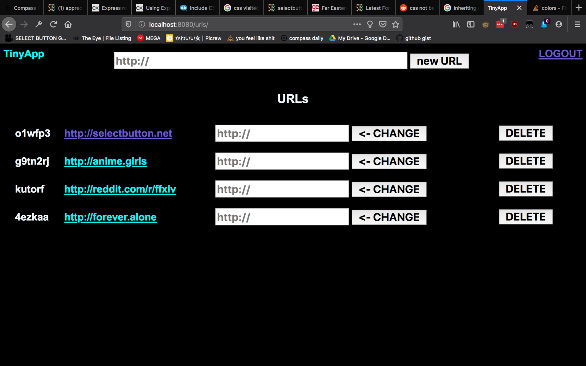

# **TINYAPP**

**A URL SHORTENING SERVICE**

---

### TINYAPP IS DESIGNED FOR:
- READABILITY
- USABILITY

using **EXTREMELY BRUTALIST DESIGN CUES**
  
and _**NOTHING ELSE**_.

---
## USING TINYAPP

### START THE PROGRAM by entering ``npm start`` on the command line, then navigate to localhost:8080 in your browser.

1. **Provide an email and password**
   - any links you create will be associated with this information
2. **Enter a valid http:// or https:// address in the top form**
    - your links will be listedon the body of the page
    - the links provided will use the shortened URL you've created 
    - You can change or delete links as you see fit
3. **LOGOUT by pressing LOGOUT**

_That's it._

---

### KNOWN ISSUES:
- **links without an http:// or https:// preamble will _NOT WORK._** please make sure to provide the full path.

---
## SCREENSHOTS:

FRONT PAGE:

URLS PAGE:

---

#### TODO:
- Refresh styling
- Collapse into a single page
- Responsive design
- comment the code. oh god. comment the code
